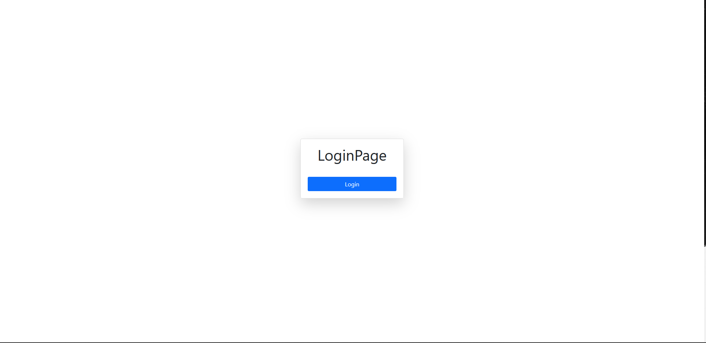
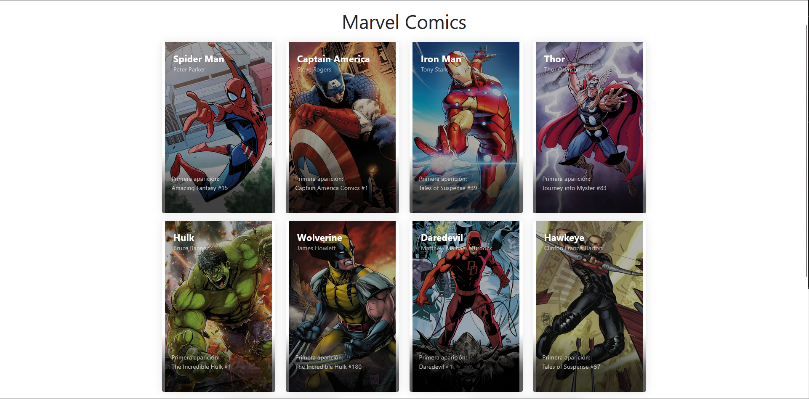
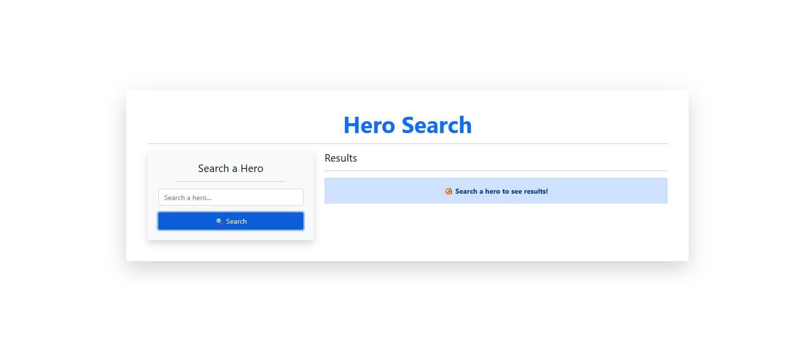
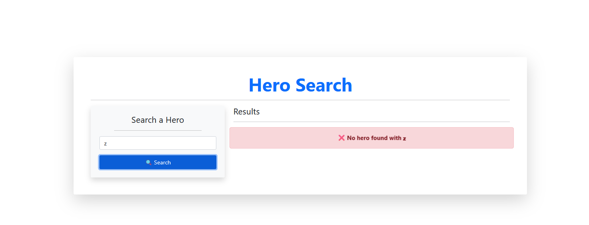
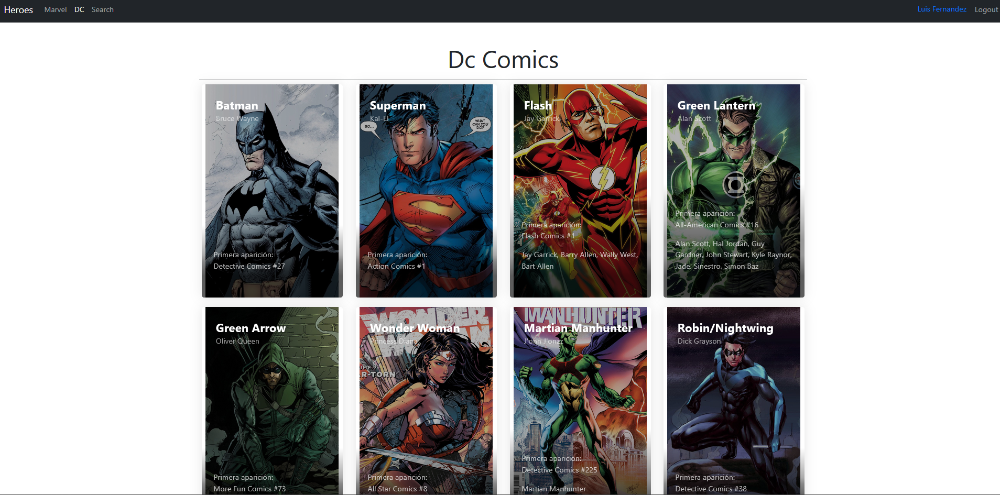
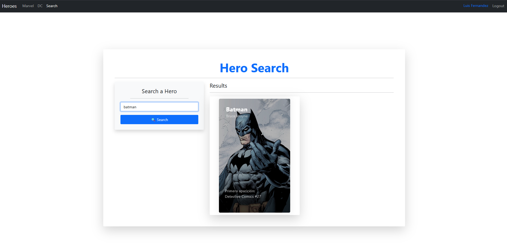
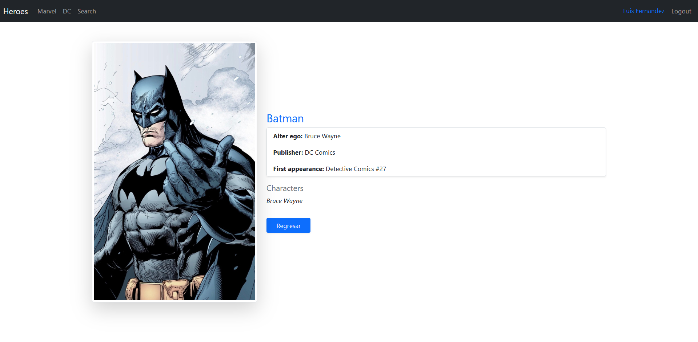

<div align="center">

# 🦸‍♂️ Heroes App

### Explora el universo de tus superhéroes favoritos

Una aplicación web interactiva construida con React que te permite descubrir, buscar y conocer a fondo a los héroes más icónicos de Marvel y DC Comics.

[](https://reactjs.org/)
[](https://vitejs.dev/)
[](https://developer.mozilla.org/en-US/docs/Web/JavaScript)
[](https://reactrouter.com/)

</div>

---

## 📸 Capturas de Pantalla

<div align="center">

|                         Login                          |                         Marvel                         |
| :----------------------------------------------------: | :----------------------------------------------------: |
|  |  |
|                   _Página de acceso_                   |             _Catálogo de Héroes de Marvel_             |

|                                                 Búsqueda y Alertas                                                 |                       DC Comics                        |
| :----------------------------------------------------------------------------------------------------------------: | :----------------------------------------------------: |
|  <br>  |  |
|                                          _Buscador interactivo y alertas_                                          |               _Catálogo de Héroes de DC_               |

|                   Búsqueda de Héroes                   |                    Perfil del Héroe                    |
| :----------------------------------------------------: | :----------------------------------------------------: |
|  |  |
|                   _Héroe Encontrado_                   |         _Página de detalles de un superhéroe_          |

</div>

---

## ✨ Características Principales

- **🦸 Catálogo Completo:** Explora extensas galerías de superhéroes de Marvel y DC Comics.
- **🔍 Búsqueda Inteligente:** Encuentra instantáneamente a tus héroes favoritos con un buscador en tiempo real.
- **📄 Perfiles Detallados:** Accede a información completa de cada héroe: poderes, primera aparición y más.
- **📱 100% Responsivo:** Diseño fluido y adaptable que funciona perfectamente en cualquier dispositivo.
- **🚀 Navegación Fluida:** Rutas optimizadas con React Router para una experiencia de usuario sin interrupciones.

---

## 🛠️ Tecnologías y Herramientas

<div align="center">

| Categoría                | Tecnología                   |
| ------------------------ | ---------------------------- |
| **Frontend Framework**   | React 18+ con Hooks          |
| **Build Tool**           | Vite 4.x                     |
| **Routing**              | React Router DOM v6          |
| **Testing**              | Jest + React Testing Library |
| **Estilos**              | CSS3 + Flexbox/Grid          |
| **Control de Versiones** | Git & GitHub                 |

</div>

### 📦 Dependencias Principales

```json
{
  "react": "^18.x.x",
  "react-router-dom": "^6.x.x",
  "vite": "^4.x.x"
}
```

---

## 🚀 Instalación y Ejecución

### 📋 Prerrequisitos

Antes de comenzar, asegúrate de tener instalado:

- [Node.js](https://nodejs.org/) (versión 16 o superior)
- [npm](https://www.npmjs.com/) o [Yarn](https://yarnpkg.com/)
- [Git](https://git-scm.com/)

### 🔧 Pasos de Instalación

1️⃣ **Clona el repositorio**

```bash
git clone ssh git@github.com:794613L/Heroes_App.git
cd Heroes_App
```

2️⃣ **Instala las dependencias**

```bash
# Con npm
npm install

# Con Yarn
yarn install
```

3️⃣ **Inicia el servidor de desarrollo**

```bash
# Con npm
npm run dev

# Con Yarn
yarn dev
```

4️⃣ **Abre tu navegador**

La aplicación estará disponible en `http://localhost:5173` 🎉

### 🏗️ Scripts Disponibles

| Comando           | Descripción                         |
| ----------------- | ----------------------------------- |
| `npm run dev`     | Inicia el servidor de desarrollo    |
| `npm run build`   | Crea la build de producción         |
| `npm run preview` | Previsualiza la build de producción |
| `npm run test`    | Ejecuta las pruebas                 |

---

## 📁 Estructura del Proyecto

```
Heroes_App/
├── 📂 public/             # Archivos públicos estáticos
├── 📂 src/
│   ├── 📂 auth/           # Módulo de autenticación
│   ├── 📂 heroes/         # Módulo de héroes
│   ├── 📂 router/         # Configuración de rutas
│   ├── 📂 ui/             # Componentes de interfaz
│   ├── 📄 HeroesApp.jsx   # Componente principal
│   └── 📄 main.jsx        # Punto de entrada
├── 📂 tests/              # Tests unitarios
├── 📄 package.json
├── 📄 vite.config.js
└── 📄 README.md
```

---

<div align="center">

### ⭐ Si te gustó este proyecto, dale una estrella!

**Hecho con ❤️ y React**

</div>
